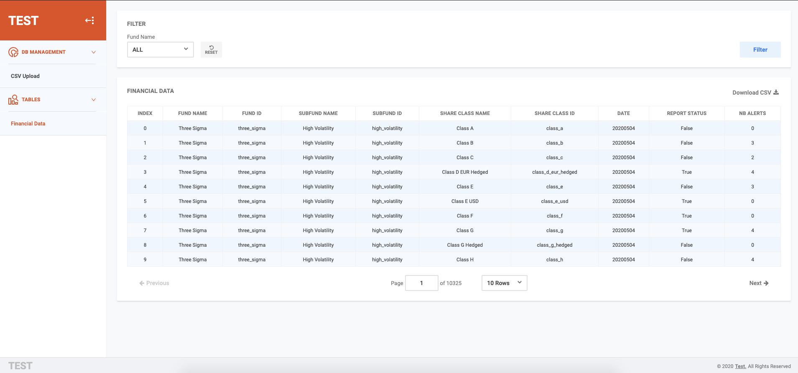
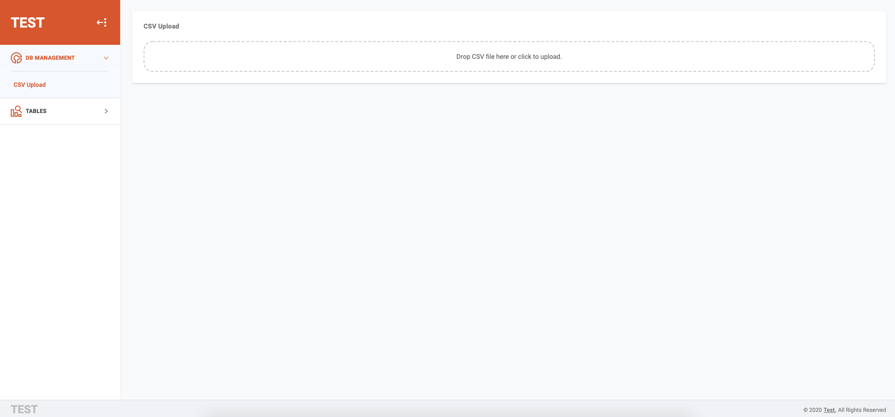
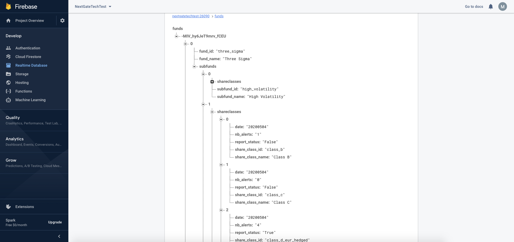
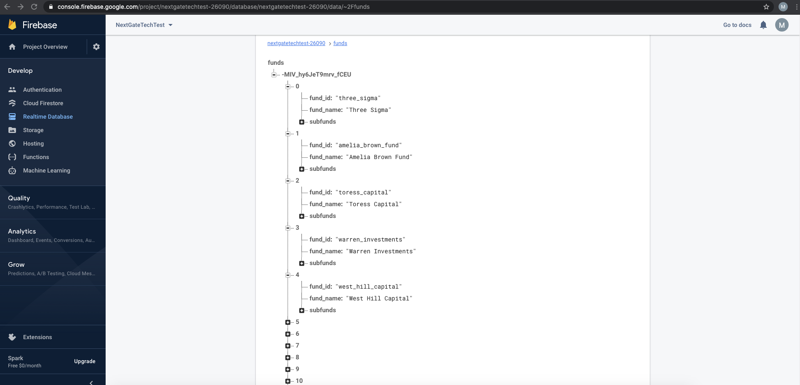
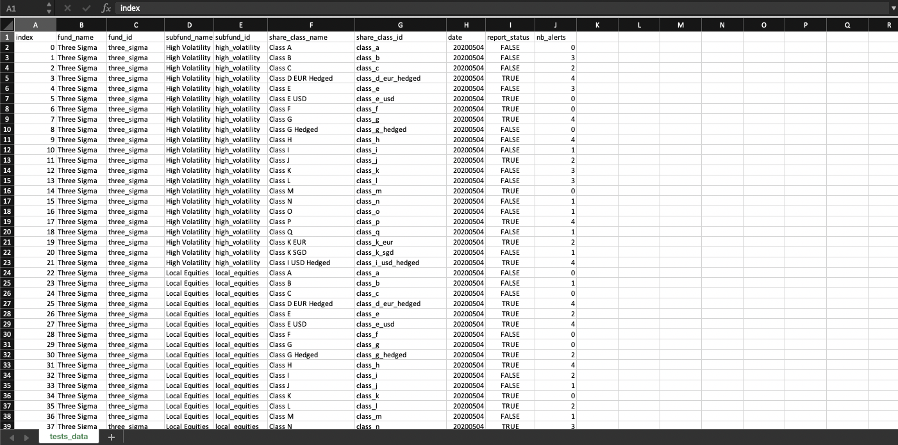

# Dashboard Project

This is dashboard project React + Firebase

## Architecture

A React Redux application based around 3 main principles:

* Exverything is a function (functional programming paradigm)
* Immutability
* Re-usability
* Keep components as stateless and functional as possible

The architecture for this application can be broken down into the following:

* __Store__ - The single source of truth for the whole application
* __Actions__ - A list of actions to perform against the store
* __Reducers__ - Containing the logic for actions
* __Components__ - Contains the reusable/specific components of ui elements (html)
* __Containers__ - Responsible for passing state to components from the store
* __Views__ - Responsible for building ui for the actual page routing
* __Hooks__ - Containg custom hooks

## Prerequisites

* node (tested with 13.x.x or more, might work with others)
* npm or yarn
* Make sure you have added ssh keys to bitbucket

## Installation Steps

* Install [NodeJS](https://nodejs.org/en/)
* Open your favourite console/terminal
* Install __yarn__ 
* Install project dependencies `$ yarn install`
* Return to __project root folder__ `cd ..`
* Start development server `$ yarn dev`

## Start development server

`$ yarn dev`

That will open a browser tab with the app and will keep linter running in a loop.

## Build prod version

`$ yarn build`

Then deploy everything inside /build to an HTTP server.

## Run tests

`$ yarn test` or `$ yarn test --coverage`

First command will watch for source changes and rerun tests as needed.

Second command will also run coverage and display reports.

## Running with Docker & Docker compose

### Run App with Docker Development Environment

```
$ docker-compose up -d --build
```

### Run App with Docker Production Environment

```
$ docker-compose -f docker-compose.prod.yml up -d --build
```

### Demo

https://nextgatetechtest-26090.web.app

### App ScreenShots

#### Dashboard Screens



#### Database Screens



### Original CSV Screen
